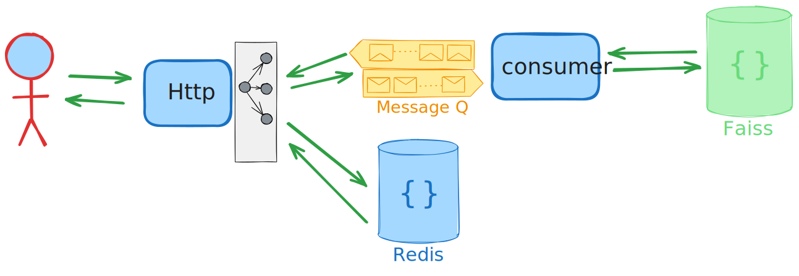
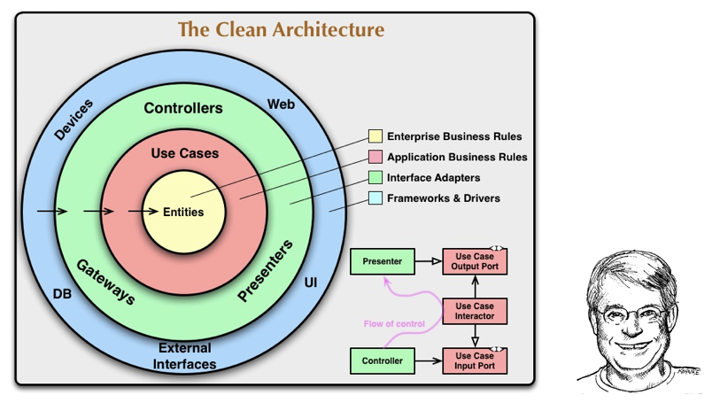
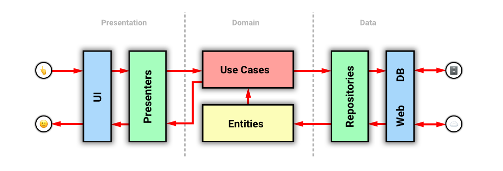

<h1 align="center">
  <br>
  <a href="https://www.parloa.com/"></a>
  <br>
    Parloa
  <br>
</h1>

<h4 align="center">A minimal Similarity Application for <a href="http://parloa.com/" target="_blank">Parloa</a> Assginment.</h4>

<p align="center">
  <a href="https://img.shields.io/badge/test-pass-green">
    
  </a>
  <a href="https://img.shields.io/badge/python-3.11-blue">
    
  </a>


</p>

<p align="center">
  <a href="#project-setup">Project Setup</a> •
  <a href="#endpoints">EndPoints</a> •
  <a href="#system-design">System Design</a> •
  <a href="#changelog">ChangeLog</a> •
  <a href="#architecture">Architecture</a> •
  <a href="#libraries">Libraries</a> •
  <a href="#future-improvements">Future Improvements</a>
</p>


## project setup

### user setup
```
docker-compose up -d
```
### developer setup

1- I'm using [pdm](https://pdm-project.org/latest/) as package manager
```
curl -sSL https://pdm-project.org/install-pdm.py | python3 -
```

2- install Dependencies
```
pdm install
```

3- add your secrets to .env file (not necessary)
```
echo "APP_URL=http://localhost:800" > .env
```

4- config modification (not necessary)
```
vim config/local.yml
```

5- setting up the infrustructure
```
docker-compose -f docker-compose.dev.yml up -d
```

6- run the consumer server
```
pdm consume 
```

7- run the apis server
```
pdm start
```

8- run the test
```bash
pdm test
```

## Endpoints
- `/docs/` : an online doc powered by swagger
- `/graphql/` : a graphql interface for similarity search
- `/knowledge_base/` : 
    - POST = add a knowledge base
    - DELETE = remove a knowledge base
- `/knowledge_base/{knowledge_base_name}/document` : 
    - POST = add a document to a knowledge base
    - DELETE = remove a document from a knowledge base
- `/knowledge_base/{knowledge_base_name}/document/?q={your_query}` : 
    - GET = get the documents that have similar content based on your query

## System Design
As depicted in the image below, this is our system design. The user interacts with an `HTTP server`, which efficiently utilizes `Redis` as the database, resulting in fast service. You might be wondering what happens with the `Faiss` and `ML model`, which can be slower. Well, we have cleverly hidden that complexity. Here's how it works: whenever a user interacts with `Redis`, if there is a need for anything `Faiss-related`, we simply send a message to the message broker while querying `Redis` simultaneously.

The beauty of this design is that all the heavy lifting happens in the `background consumer`, handling the slow processes. Leveraging Redis as both the `database` and the `message broker` allows us to streamline the system, maximizing efficiency and maintaining a cohesive architecture.



## Changelog

- **v1**: <br> March 2024. <br>**Description**: Initial proposal by me.


## Architecture

The Clean Architecture, popularized by [Uncle Bob](https://blog.cleancoder.com/uncle-bob/2012/08/13/the-clean-architecture.html), emphasizes several foundational principles:

1. **Framework Independence**: The system isn't reliant on external libraries or frameworks.
2. **Testability**: Business rules can be validated without any external elements.
3. **UI Independence**: Switching out the user interface won't affect the underlying system.
4. **Database Independence**: The system's business logic isn't tied to a specific database.
5. **Independence from External Agencies**: The business logic remains agnostic of external integrations.


*source: [yoan-thirion.gitbook.io](https://yoan-thirion.gitbook.io/knowledge-base/software-craftsmanship/code-katas/clean-architecture)

### ✨ Additional Features and Patterns in This Project

This project not only adheres to Uncle Bob's Clean Architecture principles but also incorporates modern adaptations and extended features to meet contemporary development needs:

- **GraphQL vs HTTP**:<br>The `entrypoints` module contains two API interfaces. `graphql` provides for a robust GraphQL API, while `http` focuses on RESTful API routes and controls.
- **RelationalDB vs NoSQL**:<br>The `repositories` module supports both relational and NoSQL databases. `relational_db` manages operations for databases like SQLite, MySQL, and PostgreSQL, whereas `nosql` manages operations for NoSQL databases like MongoDB and CouchDB.

Apart from following Uncle Bob's Clean Architecture, this project also incorporates:

- **Repository Pattern**:<br>An abstraction that simplifies the decoupling of the model layer from data storage, thereby promoting flexibility and maintainability in the codebase. [^1]
- **Unit of Work Pattern**:<br>This pattern ensures that all operations within a single transaction are completed successfully, or none are completed at all. [^2]
- **Dependency Injection Pattern**:<br>Helps in reducing direct dependencies between codes, increasing the testability and flexibility of modules. [^3]
- **Asynchronous SQLalchemy**:<br>By utilizing the asynchronous capabilities of SQLAlchemy 2.0, database operations are optimized for performance and efficiently handle multitasking. [^4]

### 🧱 Project Structure Overview & Clean Architecture Mapping

Based on Uncle Bob's Clean Architecture principles, this project's structure and architecture flow diagrams are aligned with these principles.

#### Directory Structure

Here's a glimpse of the project's high-level structure, highlighting primary directories and key files:

```ini
./
├── ...
├── src/
│   ├── di/                   - Dependency injection configurations for managing dependencies.
│   │   ├── dependency_injection.py
│   │   └── unit_of_work.py
│   │
│   ├── entrypoints/          - External interfaces like HTTP & GraphQL endpoints.
│   │   ├── graphql/          - GraphQL components for a flexible API.
│   │   └── http/             - RESTful API routes and controllers.
│   │                           ('Frameworks and Drivers' and part of 'Interface Adapters' in Clean Architecture)
│   │
│   ├── usecases/             - Contains application-specific business rules and implementations.
│   │                           ('Use Cases' in Clean Architecture)
│   │
│   ├── repositories/         - Data interaction layer, converting domain data to/from database format.
│   │   ├── nosql/            - Operations for NoSQL databases (e.g., MongoDB, CouchDB).
│   │   └── relational_db/    - Operations for relational databases (e.g., SQLite, MySQL, PostgreSQL).
│   │                           ('Interface Adapters' in Clean Architecture)
│   │
│   ├── models/               - Domain entities representing the business data.
│   │                           ('Entities' in Clean Architecture)
│   │
│   ├── common/               - Shared code and utilities.
│   ├── settings/
│   │   └── db/               - Database configurations.
│   │                           ('Frameworks and Drivers' in Clean Architecture)
│   │
│   └── main.py               - Main file to launch the application.
│
└── tests/
    ├── api_db_test.bats      - BATs tests for API and database interactions.
    ├── integration/          - Integration tests for testing module interactions.
    └── unit/                 - Unit tests for testing individual components in isolation.
```

#### Clean Architecture Flow Diagram

The Clean Architecture Flow Diagram visualizes the layers of Clean Architecture and how they interact. It consists of two images and an ASCII flow for clarity:

> For a detailed explanation of the ASCII flow, refer to [ascii-flow.md](./docs/ascii-flow.md).


*source: [yoan-thirion.gitbook.io](https://yoan-thirion.gitbook.io/knowledge-base/software-craftsmanship/code-katas/clean-architecture)*


*source: https://stackoverflow.com/a/73788685

